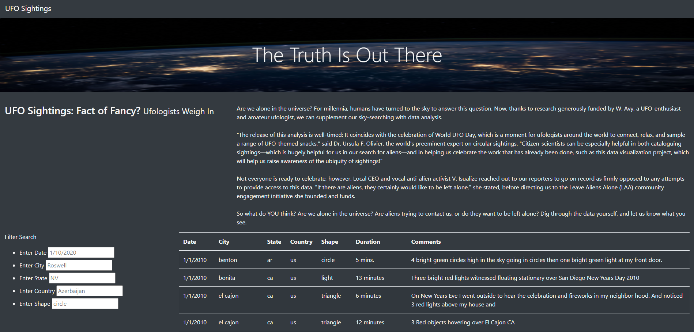
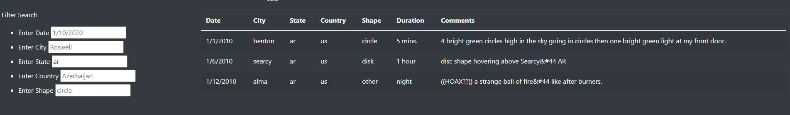
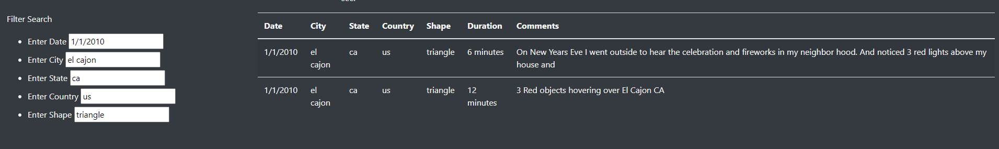

# UFOs
This project establishes a web page that shows a number of reported UFO sightings from a list of JavaScript objects. Results can also be filtered by date, city, state, country, and shape of UFO.

## Project Overview
Using JavaScript, HTML, and a little CSS, this project creates a filterable table of numerous UFO sightings

## Resources
- Data Source: data.js
- Software: VSCode, Chrome, JavaScript, HTML, CSS

## Results

### Use
To use the filter, simply type in the parameter that you wish to filter on in the appropriate filter box to the left of the table. Take note of the examples prepopulating the filter boxes, as their syntax must be followed for the project to properly filter the results. Note in the example below, "ar" is entered to show results from the state of Arkansas.

Multiple filters can be used at the same time, and they will filter the results additively, so only results that match EACH filter will be shown.

## Summary

The webpage is quite useful at filtering through the results provided, provided you understand its nuances. As is implied in the Use section, the syntax must be followed exactly. Entries are case-sensitive and must be entered all lowercase. Making the filters case-insensitive would improve the user experience. An additional area of development to consider for this project include a sighting submission form, where a user could enter a UFO sighting and have it added to the data. Another possible option for development would be to include a scraping option, or possibly an API to a popular UFO site, to continually update the sighting data.

